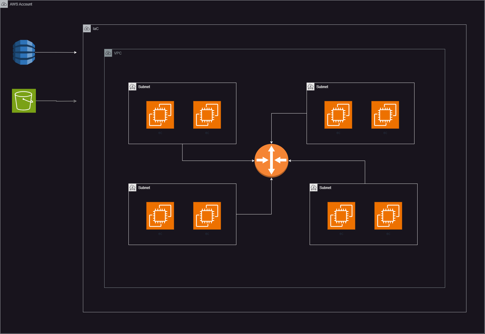

# World Skills Australia Workshop 2024

This workshop exercise demonstrates the use of Terraform code to set up the necessary infrastructure for your applications and other workloads in AWS. The objective of this exercise is to teach participants how a secure architecture can be achieve using AWS Cloud native microservices.

## What the Code Does

1. **Github Actions**: The code relies on Github Actions for automating the deployment and management of infrastructure changes. Github Actions provide a CI/CD pipeline that allows for continuous integration and continuous delivery of Terraform configurations, enabling automated testing, validation, and deployment of infrastructure updates. This integration ensures that any changes to the Terraform code are automatically tested and applied in a consistent and reliable manner.

2. **Terraform Required Resources**: The code creates an S3 bucket and DynamoDB Tableto store the Terraform state file and to handle state locking. These required resources ensures that only one person can modify the Terraform state at a time, preventing conflicts and corruption of the state file.

3. **Terraform Backend Configuration**: The code configures the Terraform backend to use the created S3 bucket and DynamoDB table for storing and locking the state file, respectively.

4. **Infrastructure Setup**: The code configures a few EC2 instances with generic security groups in different subnets as an example to represents services that can host applications.

## Usage

To use this code, follow these steps:

#### AWS Requirements

1. Create an S3 Bucket.
2. Create a DynamoDB Table with partition key `LockID`.
3. Create an IAM user and generate CLI credentials.
4. Go to the file `main.tf` and enter the values for the S3 Bucket and DynamoDB Table.

#### Github Actions

1. Please login to your github account. Yes you need one! :laughing:
2. Fork the repository into your github account.
3. From the cloned repo, go to the `Settings` tab. From the left hand menu bar choose `Secrets and variables` > `Actions` and click `New repository secret`.
4. Create two secret entries named `AWS_ACCESS_KEY_ID` and `AWS_SECRET_ACCESS_KEY`. Generate values from your IAM user account.
5. Test the code using the **Validate World Skills Australia IaC Build** workflow in the `Actions` tab.

After the resources are created, your S3 bucket and DynamoDB table will be referenced for managing the state of your Terraform configurations in AWS. Your infrastructure should look similar to this topology.

## License of Use

This code is open-source and available for non-commercial use only. Please see license file for additional usage limitations.
